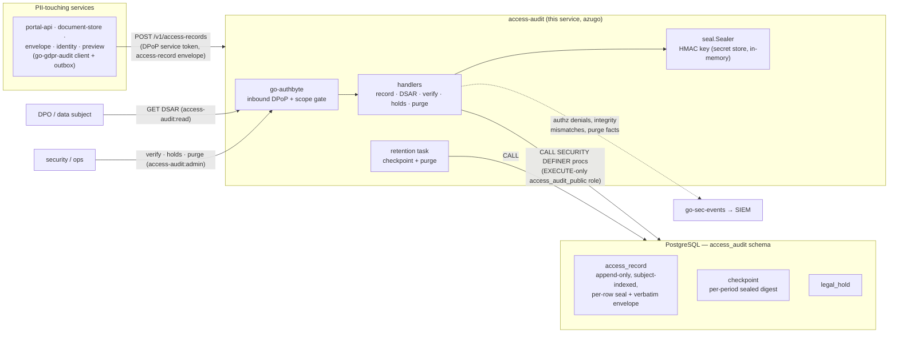
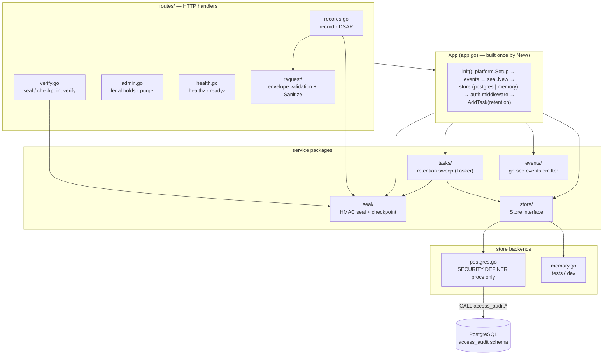
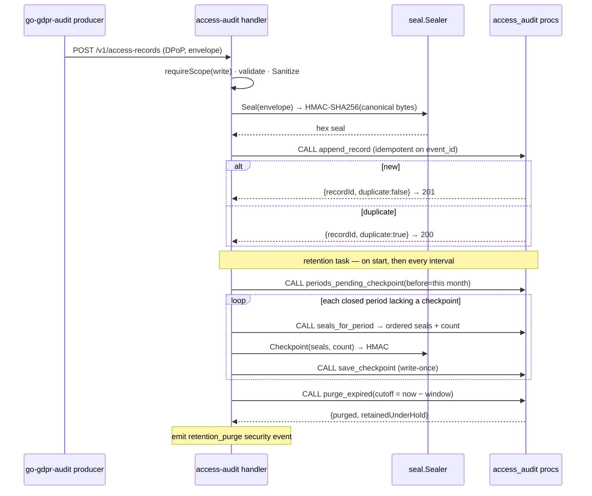

# access-audit

The **GDPR personal-data-access audit sink** — the synchronous service every other service calls to record *who accessed whose personal data, when, and on what lawful basis*. It is the server half of the reusable `go-gdpr-audit` client: producers post one access-record envelope per data touch, and this service seals it into its own append-only, subject-indexed store. It answers the three questions GDPR accountability requires — who accessed a subject's data (accountability, Regulation 2016/679 Art. 5(2)), what an organisation holds about a given subject (DSAR, Art. 15), and whether the log can be proven un-tampered.

It **records, seals, and checkpoints**; it does not interpret. Each accepted record is stored verbatim as the producer sent it, plus a per-row **HMAC-SHA256** seal (RFC 2104 / FIPS 198-1) computed over the record's canonical bytes. The seal key lives only in the service's memory, sourced from the secret store at startup — it is **never written to the database**, so a party with table-only access cannot forge a matching seal. Closed retention periods get their own sealed checkpoint, so a retained period stays independently verifiable even after older periods are purged.

The store is itself personal data. Unlike a signing-evidence log — which must survive for the legal lifetime of the documents it attests — an access log serves *accountability*, so it is kept only for a configurable window and **purged at the end of it**. A single continuous hash-chain cannot be used here: deleting purged rows would snap the chain. The per-row seal + per-period checkpoint scheme is the purge-compatible substitute.

It is built on [azugo](https://azugo.io) and follows the platform service conventions: `platform.Setup` for cross-cutting concerns, go-authbyte DPoP-bound inbound tokens, a PostgreSQL store reached **only** through `SECURITY DEFINER` procedures, and go-sec-events for its own operational security telemetry. It runs **one deployment per system**: audit data stays inside the boundary of the system it serves, and an optional `system` dimension is stamped on every record for the case where compatible systems later share one deployment. It renders no human UI.

---

## Where it sits

`access-audit` is the durable sink at the end of a fan-in. Every PII-touching service — portal-api, document-store, envelope, and the identity/preview services — carries the `go-gdpr-audit` client, which owns an outbox with retry and a fail-policy. The client posts each access record here over a DPoP-bound service token; this service commits it and makes it queryable by subject. Delivery is **synchronous, not brokered**: accountability records must be durably committed and queryable by data subject, never eventually-consistent, and an append is **idempotent on `event_id`** so an outbox retry can never double-record.



Division of labour: the `go-gdpr-audit` client (in each producer) owns durable delivery — the outbox, retry, and the caller's fail-policy. `access-audit` owns everything from the API boundary inward: authentication, the pseudonymity contract, sealing, subject-indexed persistence, integrity verification, and the retention lifecycle. The two meet at the `POST /v1/access-records` transport. `source_service` and `system` are derived from the **authenticated identity**, never from the request body.

---

## HTTP surface

All `/v1` routes require a go-authbyte DPoP-bound service token carrying an `access-audit:<level>` scope; the level is checked with a group+level scope test, and every denial emits an `authz.denied` security event. `/healthz` and `/readyz` are public.

| Method + path | Scope | Purpose |
|---|---|---|
| `POST /v1/access-records` | `write` | Record one `gdpr_access` envelope. Idempotent on `event_id` — **201** on a new row, **200** with `duplicate: true` on an outbox retry |
| `POST /v1/verify-events` | `verify-audit:write` | Record one abuse-evidence event for a public (anonymous) document-verification surface — the service's second, **purpose-scoped** store: its own `verify_audit` schema, its own scope group, its own (shorter) retention. Carries request metadata + the upload's hash, never document content |
| `GET /v1/subjects/{subject}/access-records` | `read` | DSAR (Art. 15): every access to a data subject's data, each with a live integrity check of its stored seal. `?from` / `?to` (RFC 3339), `?limit` (default 1000, cap 10000) |
| `GET /v1/verify?subject=` | `admin` | Re-verify every stored seal for a subject |
| `GET /v1/verify?period=YYYY-MM` | `admin` | Recompute a retention period's checkpoint from current rows and compare it to the sealed value (`YYYY-MM` or `YYYY-MM-DD`) |
| `POST /v1/legal-holds` | `admin` | Exempt a subject from purge (`{subject, reason}`) |
| `DELETE /v1/legal-holds/{subject}` | `admin` | Clear a hold — the subject's records become purge-eligible again |
| `POST /v1/purge` | `admin` | Trigger the retention purge immediately (also runs on schedule) |
| `GET /healthz` | public | Liveness — `200 ok` whenever the process is up |
| `GET /readyz` | public | Readiness — `503` when the store is unreachable |

On the write path the record body is the access-record envelope; the service **sanitises it defensively** before sealing — it strips content-bearing attribute keys (`document_bytes`, `free_text`, `email`, `phone`, …), truncates string attribute values to 256 runes, and rejects any `data_subjects` value that looks like a national identifier, an e-mail, or a name with spaces. The `data_subjects` contract is **pseudonymous internal references only**; identifying values must never land in the store or its DSAR index.

---

## Architecture

One application object (`App` in [`app.go`](app.go)) wires every dependency at startup: the platform cross-cutting setup, the HMAC sealer (fails closed if the key is shorter than 32 bytes), the store backend (PostgreSQL when a DSN is configured, in-memory otherwise), the go-authbyte inbound middleware, and the retention task. A missing or too-short seal key stops the process from starting.



**Record → seal → append**, and the periodic **checkpoint / purge** cycle:



---

## Tamper evidence & retention

The integrity scheme is deliberately purge-compatible — a retained period can be proven intact without reference to any period that has since been deleted.

- **Per-row seal.** On append the service computes `HMAC-SHA256(key, canonical(envelope))` and stores the hex digest alongside the verbatim record. The canonical form is a fixed-order projection of the content-bearing envelope fields with `data_subjects` and `category` sorted and `occurred_at` normalised to RFC 3339 nano UTC, so the bytes reproduce exactly after the JSON/JSONB round-trip the verify path relies on. It deliberately **excludes** any store-assigned sequence — the seal attests the producer's content, not anything the database adds. Verification is a constant-time compare (`hmac.Equal`).
- **Per-period checkpoint.** The retention task seals an HMAC over each closed period's ordered row seals plus the row count. Adding or removing a row after the checkpoint changes both the count and the seal list, so the recomputed checkpoint no longer matches — which is exactly what proves a retained period was not altered. Checkpoints are **write-once** per period.
- **Append-only.** The store role can only `INSERT` and `SELECT` through procedures; `UPDATE` is always blocked, and `DELETE` is permitted only inside the purge procedure (enforced by a `REVOKE` plus an append-only guard trigger in the schema).
- **Legal hold.** A subject can be exempted from purge (`POST /v1/legal-holds`) — e.g. for an active investigation or dispute. Held subjects' records are skipped by every purge, and a purge that retained anything under hold is raised to a warning-severity security event so it stays visible.
- **Purge of the expired.** The `access-audit-retention` task runs an initial sweep at startup and then on the configured interval: it checkpoints every closed period that lacks one, then purges every period older than the accountability window (holds skipped) and emits the fact of purge as a security event. `POST /v1/purge` triggers the same sweep on demand.

---

## State and data model

**The service never touches tables.** PostgreSQL is reached exclusively through the `access_audit` schema's `SECURITY DEFINER` procedures, invoked via a uniform JSONB in/out envelope; the service's database role (`access_audit_public`) holds `EXECUTE`-only grants and no direct table DML. A procedure that fails after a write re-raises a structured error to force a rollback, and the store decodes that back into the same typed error shape as a validation failure — so a partial write is never observable.

The procedures the store calls:

| Procedure | Role |
|---|---|
| `append_record` | Idempotent append (on `event_id`), stores the verbatim envelope + seal |
| `records_by_subject` | DSAR read — every record whose `data_subjects` include the subject |
| `seals_for_period` | A period's per-row seals ordered by `event_id`, plus count (for checkpointing) |
| `periods_pending_checkpoint` | Closed periods that hold records but have no checkpoint yet |
| `save_checkpoint` | Persist a period checkpoint (write-once) |
| `load_checkpoint` | Read a period's stored checkpoint |
| `set_legal_hold` | Place or clear a hold on a subject |
| `purge_expired` | Delete records in periods older than the cutoff, skipping held subjects |

The three logical tables: **`access_record`** (append-only; the verbatim envelope, the per-row seal, and the server-derived `source_service` / `system`; subject-indexed for DSAR — a GIN index over `data_subjects` in the schema makes a lookup by subject a single indexed query), **`checkpoint`** (one sealed digest per closed retention period), and **`legal_hold`** (purge exemptions). A retention period is a first-of-month UTC bucket.

An in-memory backend (`store/memory.go`) mirrors the same semantics — idempotent append, subject-indexed reads, write-once checkpoints, holds and purge — and is selected automatically when no DSN is configured. It is **non-durable and for development/tests only**.

---

## Configuration

Standard platform/azugo + go-authbyte env applies (`SERVER_URLS`, `SERVICE_NAME`, `ENVIRONMENT`, `AUTH_ISSUER_URL`, `SERVICE_AUDIENCE=svc:access-audit`, `METRICS_ENABLED`, `OTEL_*`). Service-specific:

| Env var | Default | Meaning |
|---|---|---|
| `ACCESS_AUDIT_STORE_DSN` | — (empty ⇒ in-memory) | PostgreSQL DSN; connects as the EXECUTE-only `access_audit_public` role. Unset selects the non-durable in-memory backend (**development only**). Source it from the secret store in production — it carries a password. Pool size comes from the DSN itself — `pool_max_conns` (pgx reads it and strips it before Postgres sees it; its default is the host's CPU count): set it explicitly to the deployment's connection budget, e.g. `?sslmode=…&pool_max_conns=4&pool_min_conns=1`. |
| `ACCESS_AUDIT_SEAL_KEY` | — (**required**, ≥ 32 bytes) | HMAC key for per-row seals and per-period checkpoints. Held in memory only; **never persisted with the records**. Loaded from the platform remote secret store when available, else from the environment. A shorter key fails startup |
| `ACCESS_AUDIT_SYSTEM` | `default` | Optional tenant/system dimension stamped on every record |
| `ACCESS_AUDIT_RETENTION_INTERVAL` | `24h` | Retention sweep cadence (checkpoint closed periods, then purge) |
| `ACCESS_AUDIT_RETENTION_WINDOW` | `8760h` (365 days) | Accountability window; records in periods older than `now − window` are purged unless under hold. The concrete value is a data-protection decision |
| `VERIFY_AUDIT_RETENTION_DAYS` | `90` | Retention window (days) for the verify abuse-evidence store; its sweep rides the same schedule. IP/user-agent are personal data — the window keeps holding them proportionate |

The seal key is one operator secret. Keep it out of version control, supply it from the secret store, and back it up independently of the database — a lost key makes every stored seal unverifiable, and a key that differs from the one used at append time makes every seal read as a mismatch.

---

## Security events

The service emits its own operational security telemetry through go-sec-events (distinct from the GDPR access *records* it stores). Request-scoped events carry the request's correlation and trace ids; background events (from the retention task, where there is no request context) are stamped locally and written to the logger in the same sink shape, so the SIEM stream is uniform regardless of origin.

| Event type | When |
|---|---|
| `authz.denied` | A caller lacks the required `access-audit:<level>` scope |
| `access_audit.integrity_mismatch` | A verify pass (or a DSAR read) finds a broken seal or checkpoint — high severity |
| `access_audit.checkpoint_written` | The retention sweep sealed a period checkpoint |
| `access_audit.retention_purge` | A purge ran (warning severity if anything was retained under hold) |
| `access_audit.legal_hold_changed` | A hold was placed or cleared |

---

## Directory layout

```
access-audit/
├── app.go                  — App container: config, platform setup, sealer, store, auth, retention task
├── config.go               — Configuration (env binding, defaults, seal-key validation, store-backend select)
├── testing.go              — TestApp + header-driven stub auth middleware (test wiring)
├── cmd/server/             — CLI entrypoint: web (default) + health subcommands
├── events/                 — go-sec-events emitter (request-scoped + background)
├── seal/                   — HMAC-SHA256 per-row seal + per-period checkpoint, constant-time verify
├── routes/
│   ├── router.go           — route registration + requireScope (group+level scope gate)
│   ├── records.go          — POST record · GET subject DSAR
│   ├── verify.go           — GET /v1/verify (subject seals | period checkpoint)
│   ├── admin.go            — legal holds · manual purge
│   ├── health.go           — healthz · readyz
│   ├── request/            — envelope validation + Sanitize (pseudonymity contract)
│   └── response/           — response DTOs
├── store/
│   ├── store.go            — Store interface + Record / Checkpoint / PurgeResult + Period bucketing
│   ├── postgres.go         — SECURITY DEFINER procedure calls (no raw table SQL)
│   └── memory.go           — non-durable in-memory backend (dev/tests)
├── tasks/                  — retention Tasker: checkpoint closed periods, then purge expired
├── Dockerfile              — static binary on rootless scratch (nonroot); health subcommand as HEALTHCHECK
└── .github/workflows/ci.yml — build · vet · lint · vulnerability scan · race tests + coverage,
                              then image build → SBOM → image scan → publish → signature
```

---

## Development

There is no Makefile — the standard Go toolchain is used directly, and CI runs `go vet` plus race tests:

```sh
go mod tidy            # resolve go.sum (platform libs resolve from their tags)
go build ./...
go vet ./...
go test -race ./...

go run ./cmd/server web    # start the server (in-memory store if no DSN)
```

Tests run entirely against in-process fakes — the in-memory store and a header-driven stub auth middleware (`X-Test-Scopes` / `X-Test-Sub`) built by `TestApp` in [`testing.go`](testing.go) — so no Docker or network is required. Production wiring always uses the go-authbyte DPoP middleware; the stub exists only for tests. The container image builds a static binary on a minimal rootless scratch base (`ghcr.io/wntrtech/scratch`, non-root `app` user, CA certs + tzdata) and reuses the binary's own `health` subcommand as the Docker `HEALTHCHECK`.

---

## Security invariants

- **Append-only.** The store role can only `INSERT`/`SELECT` via procedures; `UPDATE` is always blocked and `DELETE` happens only inside the purge procedure, behind a guard trigger.
- **Seal key never in the database.** The HMAC key lives only in service memory, loaded from the secret store; table-only access cannot forge a seal, and verification is constant-time.
- **Purge-safe integrity.** Per-row seals + per-period checkpoints replace a continuous hash-chain, so purging an expired period never invalidates a retained one.
- **Subject pseudonymisation enforced at the sink.** `data_subjects` values that look like national identifiers, e-mails, or names are rejected; content-bearing attribute keys are stripped and values truncated — defence-in-depth over the producer's own contract.
- **Identity from the token, not the body.** `source_service` and `system` come from the authenticated caller; the body cannot spoof them.
- **Least privilege.** DPoP-bound service tokens, `access-audit:<level>` scope per route, and an EXECUTE-only database role.
- **The log is itself PII.** It is minimised (no document content, no free text) and time-bounded — kept only for the accountability window, then purged.

---

## Known limitations

- **Seal-key rotation is not yet implemented.** Rotating the HMAC key requires a re-seal / re-checkpoint workflow; today a single key protects the whole store, so it must be preserved for the life of the retained data.
- **Retention periods are a logical month bucket**, not physical range partitions. The purge and checkpoint semantics are unaffected; physical declarative partitioning of `access_record` by period is a future optimisation.
- **No inbound queue by design.** Durability on the producer side is the `go-gdpr-audit` outbox; this service is a synchronous sink and does not buffer.
- **In-memory backend is non-durable** — intended for development and tests only; production always configures a PostgreSQL DSN.

---

## Contributing

Bug reports and pull requests are welcome. [CONTRIBUTING.md](CONTRIBUTING.md) names the gate a
change has to pass, and the invariants a change to the append, seal or purge paths must not weaken
— starting with the one that surprises people: the canonical form a record is sealed over is a
stored-data contract, so changing it invalidates every seal already written.

Suspected vulnerabilities go through the private route in [SECURITY.md](SECURITY.md) — never a
public issue. This service is both the evidence that an access happened and personal data in its
own right, so that file also says which failures we treat as most serious, and it is worth reading
before deciding whether something you found is worth reporting.

## Licence

**MIT** — see [LICENSE](LICENSE).

Use it, modify it, ship it inside a commercial product; keep the copyright notice and the licence
text with it. There is no network clause here — running a modified version as a service triggers
no additional obligation.
